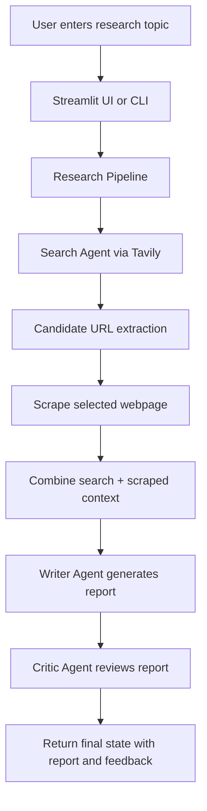

# AIResearchAgent

AIResearchAgent is a multi-agent research assistant built with Python, LangChain, Groq, and Tavily. It searches for recent information on a topic, picks the most relevant source, scrapes the content, writes a structured research report, and gives a critic-style review of the output.

This project is designed to help automate research workflows with a lightweight user experience in both CLI and Streamlit app modes.

## Features

- Topic-based web research using Tavily search
- Automatic source selection and content scraping
- LangChain-based agent flow for retrieval and reading
- Structured research report generation with Groq LLMs
- Critic feedback with strengths, gaps, and verdict
- Simple Streamlit UI for interactive use

## Project Structure

```text
AIResearchAgent/
├── app.py                 # Streamlit web interface
├── main.py                # CLI entry point for the research pipeline
├── requirement.txt        # Python dependencies
├── README.md              # Project documentation
├── src/
│   ├── __init__.py
│   ├── agents/
│   │   ├── __init__.py
│   │   └── agents.py      # LLM agents, prompts, URL selection, report writing
│   ├── pipelines/
│   │   ├── __init__.py
│   │   └── pipeline.py    # orchestration for the research flow
│   └── tools/
│       ├── __init__.py
│       └── tools.py       # Tavily search, scraping, and output cleanup
└── .env                   # Local environment variables (not committed)
```

## How It Works

The pipeline follows a simple research loop:

1. Search for recent, relevant information on the requested topic.
2. Extract the best candidate URL from the results.
3. Scrape the selected page for readable content.
4. Combine search snippets and scraped text.
5. Generate a detailed report.
6. Critique the report with a score and improvement notes.

## High-Level Design (HLD)

### System Overview

The application is composed of three main layers:

- User Interface Layer: the Streamlit app (`app.py`) provides an interactive topic input and shows the pipeline output.
- Orchestration Layer: `src/pipelines/pipeline.py` coordinates the research flow and manages the state across each step.
- Intelligence Layer: `src/agents/agents.py` contains the LLM prompts, search agent logic, URL selection, report writing, and expert critique.
- Tooling Layer: `src/tools/tools.py` wraps external APIs and extraction logic for web search and scraping.

### Component Responsibilities

#### 1. Web Search
- Uses Tavily to search for recent and trustworthy sources.
- Returns titles, URLs, and snippets for a given topic.
- Helps the system discover candidate sources before scraping.

#### 2. URL Selection
- Parses the search output for candidate URLs.
- Validates them with HTTP checks.
- Chooses the most relevant page to scrape deeper.
- Falls back to an LLM-based URL extraction when needed.

#### 3. Page Scraping
- Fetches the body of the selected article.
- Uses multiple extraction strategies (`trafilatura`, `readability`, and fallback parsing).
- Cleans the output into a concise readable text block.

#### 4. Report Generation
- Combines search results and scraped article text.
- Passes this context into a Groq-backed writer prompt.
- Produces a structured report with introduction, findings, conclusion, and sources.

#### 5. Critic Review
- Runs a second LLM stage that evaluates the report.
- Produces a score, strengths, improvement areas, and a verdict.
- Provides fallback output if the critique model fails.

### Data Flow



### Architectural Notes

- The design is intentionally modular so each step can be tested independently.
- The pipeline uses a state dictionary to carry data between stages.
- External dependencies are isolated in tool modules to make the research workflow easier to maintain.
- Fallback logic is included for both report generation and critique to improve resilience in production-like conditions.

## Prerequisites

- Python 3.11+
- A Groq API key
- A Tavily API key
- Internet access for web search and article scraping

## Setup

Clone the project and create a virtual environment:

```bash
git clone <your-repo-url>
cd AIResearchAgent
python -m venv .venv
```

Activate it:

- Windows PowerShell:

```powershell
.\.venv\Scripts\Activate.ps1
```

- macOS/Linux:

```bash
source .venv/bin/activate
```

Install dependencies:

```bash
pip install -r requirement.txt
```

## Environment Variables

Create a `.env` file in the project root:

```env
GROQ_API_KEY=your_groq_api_key
GROQ_MODEL=openai/gpt-oss-120b
TAVILY_API_KEY=your_tavily_api_key
```

Notes:

- The project also accepts `GROQ_TOKEN` as an alternative to `GROQ_API_KEY`.
- `TRAVILY_API_KEY` is accepted as an alternate Tavily variable name.
- If the model variable is omitted, it defaults to `openai/gpt-oss-120b`.

## Running the Project

### 1. CLI Mode

This executes the research pipeline for a hardcoded topic:

```bash
python main.py
```

In `main.py`, the current default topic is:

```python
topic = "The impact of AI on the job market in 2026"
```

You can change that string to any topic you want.

### 2. Streamlit Web App

Start the interface:

```bash
streamlit run app.py
```

Then open the local URL shown by Streamlit in your browser and enter a research topic.

## Example Output

The pipeline produces a dictionary-like state containing:

- `search_results`
- `scraped_content`
- `report`
- `feedback`

The generated report includes:

- Introduction
- Key Findings
- Conclusion
- Sources

The critic review includes:

- Score
- Strengths
- Areas to Improve
- One-line verdict

## Dependencies

This project uses:

- LangChain and LangChain Core
- LangChain Groq integration
- LangGraph agent building
- Tavily search API
- `requests`, `BeautifulSoup`, `trafilatura`, and `readability-lxml` for scraping
- Streamlit for the app UI
- Python-dotenv for environment loading

## Troubleshooting

### Missing API keys

If you see an error saying the API key is missing, confirm that your `.env` file exists and contains valid values.

### Search or scrape errors

If the web search or scraping returns poor data:

- verify your Tavily key is valid
- ensure the target site is reachable
- confirm your machine has outbound internet access

### Dependency issues

If installation fails, try upgrading pip first:

```bash
python -m pip install --upgrade pip
pip install -r requirement.txt
```

## License

This project is distributed under the license included in the repository.

## Notes

This is a research automation prototype and may occasionally produce weaker results depending on source quality, LLM behavior, and website restrictions. The code includes fallback report and critic generation to keep the pipeline working even when one step fails.
